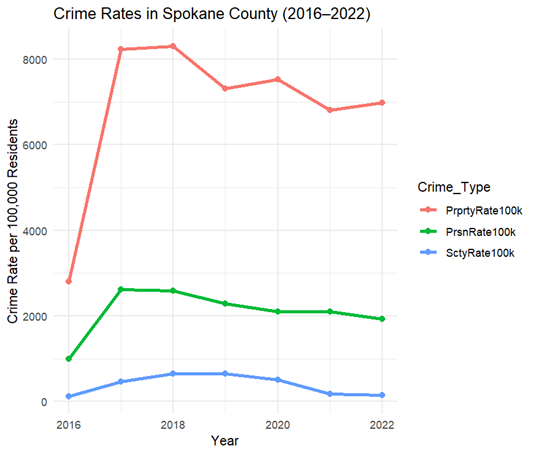
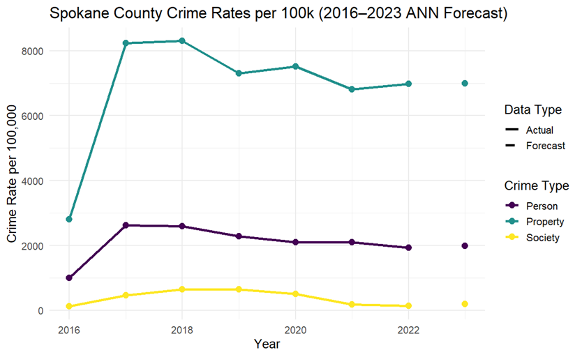

# Crime Trends in Spokane County (2016–2022) with 2023 Forecasts

## Overview
This project analyzes **crime trends in Spokane County, WA** from 2016 to 2022 using the **National Incident-Based Reporting System (NIBRS)** dataset.  
The goal was to identify patterns in **person, property, and society crimes** and generate **forecasts for 2023** using statistical and time-series methods.  
This analysis demonstrates skills in **data cleaning, exploratory data analysis (EDA), regression, and forecasting.**

---

## Research Question
**How have person, property, and society crime rates changed in Spokane County from 2016–2022, and what are the forecasted trends for 2023?**

---

## Tools & Libraries
- **Language:** R (RStudio)  
- **Key Libraries:** `forecast`, `stats`, `ggplot2`, `dplyr`  
- **Techniques:**  
  - Data cleaning & imputation  
  - Exploratory Data Analysis (EDA) with visualizations  
  - Linear regression  
  - Moving average (2-year and 3-year lags)  
  - Exponential smoothing (ANN models)

---

## Dataset
- Source: National Incident-Based Reporting System (NIBRS)  
- Records: ~2,900 crime observations (2012–2022 across WA counties)  
- Focus: Filtered to **Spokane County (2016–2022)**  
- Variables: Person crimes, Property crimes, Society crimes, Rates per 100k population  

---

## Analysis Steps
1. **Data Cleaning**
   - Imputed 99 missing values using median substitution  
   - Filtered to Spokane County and removed inconsistent years (2012–2015)

2. **Exploratory Data Analysis (EDA)**
   - Summary statistics and trend plots for person, property, and society crime rates  
   - Normalized rates to per 100,000 population for comparability  

3. **Modeling & Forecasting**
   - **Linear Regression** → No statistically significant trends found (p > 0.05)  
   - **Moving Average** (best fit for irregular but stable data):  
     - 3-year MA for Person & Property crimes  
     - 2-year MA for Society crimes  
   - **Exponential Smoothing** → Alternative forecasts tested, but higher error  

---

## Key Results
| Crime Type      | Best Model | 2023 Forecast (per 100k) |
|-----------------|------------|--------------------------|
| Person Crimes   | 3-year MA  | **2,043**                |
| Property Crimes | 3-year MA  | **7,102**                |
| Society Crimes  | 2-year MA  | **164**                  |

**Interpretation**:  
- Crime rates in Spokane County remained **relatively stable** from 2016–2022.  
- Forecasts suggest **continued stability in 2023** without major upward or downward trends.  

## Visuals

### Crime Rates in Spokane County (2016–2022)

### Forecasted Crime Rates (2016–2023)

## Insights & Implications
- Despite year-to-year fluctuations, **no significant long-term trends** were found.  
- Forecasting models confirm that crime rates are expected to remain steady in the near future.  
- These insights could be valuable for **public safety planning and resource allocation** in Spokane County.  
